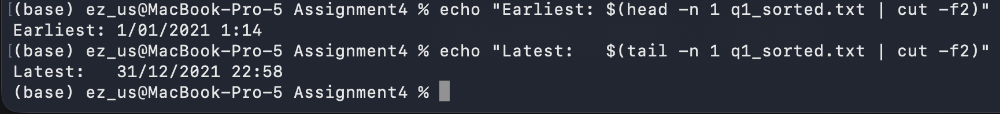
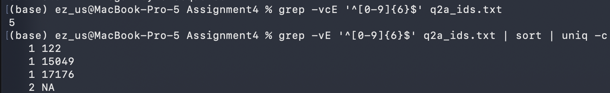

# Task A


## Q1 — sold_time range of the records

1. What is the sold_time range of the records? Please include the full year, month, date, and time information when presenting the range.

### Approach

`sold_time` has the form `"D/M/YYYY H:MM"` but is **not** zero-padded (`8/11/2021 16:33` sits beside `27/03/2021 22:17`). Alphabetical `sort` would therefore be **wrong** for chronology, so we convert each value to a sortable form `YYYY-MM-DD HH:MM` before sorting.


### Code

```
# tep 1: extract sold_time column, skip header, drop Windows CRs,
# and keep only values that look like a date+time

tail -n +2 TaskA_property_victoria.csv \
  | cut -d, -f4 \    # -d means delimeter
  | tr -d '\r' \     # \r sanitary data, delete 'return'
  | grep -E '^[0-9]+/[0-9]+/[0-9]+ [0-9]+:[0-9]+$' \  # Extended Regular Expressions, which allows you to use complex patterns.
  > q1_sold_times.txt  # output as a new file

  # Anwser is 48480 q1_sold_times.txt
 
# Step 2: convert each "D/M/YYYY H:MM" into "YYYY-MM-DD HH:MM<TAB>original"
# The -F'[ /:]' tells awk to split on space, slash, OR colon, so
# "27/03/2021 22:17" becomes 5 fields: 27, 03, 2021, 22, 17.
 
awk -F'[ /:]' '{ printf "%04d-%02d-%02d %02d:%02d\t%s\n", $3, $2, $1, $4, $5, $0 }' \ # -F flag defines the Field Separator (what breaks the line into pieces)
q1_sold_times.txt \
| sort \
> q1_sorted.txt

# peek: top of sorted list
head -n 2 q1_sorted.txt    
# output
# 0420210101 01:00	1/01/2021 8:01
# 0420210101 03:00	1/01/2021 22:03

# peek: bottom of sorted list
tail -n 2 q1_sorted.txt 
# output:
# 0420211231 58:00	31/12/2021 22:58
# 0420211231 58:00	31/12/2021 7:58

# Print the result
echo "Earliest: $(head -n 1 q1_sorted.txt | cut -f2)"
echo "Latest:   $(tail -n 1 q1_sorted.txt | cut -f2)"
         
```


#### Answer: The `sold_time` range of the records is **1 January 2021 at 1:14** to **31 December 2021 at 22:58**.

### Screen shot


### Explaination
1. Isolate `sold_time` column.
    - `cut -d, -f4`, cut the 4th column accordding to assignment desctiption.
    - `tr -d 'r'`, removes 'return' character.
    - `grep ...` filter rows with valid time format. 
    - output it as a new text file: q1_sold_times.txt, which include 48480 data.

2. Sort sold_times.
    -  Standardise time format. current date would look like "M/D/YYYY H:S" or "MM/DD/YYYY HH:SS", Which determined by whether have "0" or not on date, and 24-hour time standard. It lead to disorder. Parse date form first, then sort.
    
    - `awk -F'[ /:]'` splits a string like `"27/03/2021 22:17"` on any of space, slash, or colon — so we get the five fields `27`, `03`, `2021`, `22`, `17`. 

    - Then `printf"%04d-%02d-%02d %02d:%02d\t%s\n", $3(year), $2(month), $1(day), $4(hour), $5(minuete), $0(Placeholder: No second here)` rearranges them year-first and prints both the sortable form and the original. 
    
    - `sort` orders the lines alphabetically — but because our key iszero-padded and year-first, alphabetical order IS chronological order.

3. Strip off the first and last line to get answers
    - `echo` can be regarded as `print` or `cat`(R)

### Solucion 2

While I rerun comment below, it turned an error `cut: stdin: Illegal byte sequence`. During figuing out what it is. I noticed there are an OS mismatch error.

```
tail -n +2 TaskA_property_victoria.csv \
  | cut -d, -f4 \
  | tr -d '\r' \
  | grep -E '^[0-9]+/[0-9]+/[0-9]+ [0-9]+:[0-9]+$' \
  > q1_sold_times.txt
```

Hence, here is another version for anwers.

#### Code 2
```
cd ~/Documents/5145/Assignment4

# Step 0: switch the whole session to byte-mode (fixes the Illegal byte sequence)
export LC_ALL=C

# Step 1: confirm — should now print "C"
echo $LC_ALL

# Step 2: throw away the stale caches and re-run Q1
rm -f q1_sold_times.txt q1_sorted.txt q2a_ids.txt

tail -n +2 TaskA_property_victoria.csv \
  | cut -d, -f4 \
  | tr -d '\r' \
  | grep -E '^[0-9]+/[0-9]+/[0-9]+ [0-9]+:[0-9]+$' \
  > q1_sold_times.txt

wc -l q1_sold_times.txt        
# turn to 127699, compare 48480 before. 

awk -F'[ /:]' '{ printf "%04d-%02d-%02d %02d:%02d\t%s\n", $3, $2, $1, $4, $5, $0 }' \
  q1_sold_times.txt | sort > q1_sorted.txt

echo "Earliest: $(head -n 1 q1_sorted.txt | cut -f2)"
echo "Latest:   $(tail -n 1 q1_sorted.txt | cut -f2)"

```
#### Answer 2
The `sold_time` range of the records is **1 January 2020 at 00:23** to
**31 December 2021 at 23:58**.

*Note:* the assignment brief says the file is 2021 transactions, but the
data actually starts on 1 January 2020.


## Q2 - Preprocess the ID(f1) and sold_time(f4) column.

### Q2a - Count lines aren't 6-digit long.

#### Approach

regex `^[0-9]{6}$` would be valid ID

#### Code
 ```
 # S1: extract ID column, skip header
tail -n +2 TaskA_property_victoria.csv | cut -d, -f1 > q2a_ids.txt

 # S2: count rows whose ID isn't a 6-digit long nuber
 # grep -v inverts the match; -c means 'count'
 grep -vcE '^[0-9]{6}$' q2a_ids.txt

 ```

#### Answer
**5 rows** have an `ID` that is not a 6-digit number: 3 rows whose IDs are short numbers(`122`, `15049`, `17176`), and 2 rows where the
ID is the literal string `NA`.

#### Screenshot


Due to mismatch finded on Question one, re-run question 2 would get different anwer as well.
```
# re-run Q2a

tail -n +2 TaskA_property_victoria.csv | cut -d, -f1 > q2a_ids.txt
grep -vcE '^[0-9]{6}$' q2a_ids.txt              
# turn to 9, compared to 5 before.

grep -vE  '^[0-9]{6}$' q2a_ids.txt | sort | uniq -c
```
#### Answer 2

**9 rows** have an `ID` that is not a 6-digit number: 5 rows where the
ID is the literal string `NA`, and 4 rows whose IDs are short numbers
(`122`, `2396`, `15049`, `17176`).

#### Explanation

- `grep -v` keeps lines that **do not** match the pattern. `-c` return to the number of count.

- `^[0-9]{6}` means 6 digits. `$` limited the output **exactly** equal to 6.

-  `sort | uniq -c` arrange unique count value from small to large.


### Q2b — Drop bad-ID rows and strip the time from sold_time

#### Approach

Two transformations:
1. Keep the header plus rows valid ID, which matches `^[0-9]{6}$`.
2. In each kept row, remove the ` HH:MM` substring from column 4.

#### Code
```
# Step 1: extrack a valid ID. Keep header (NR==1) plus rows with 6-digit long form.
awk -F, 'NR==1 || $1 ~ /^[0-9]{6}$/' TaskA_property_victoria.csv > q2b_valid_ids.csv

wc -l q2b_valid_ids.csv  # check

# output: 1 header + 127706 data rows = 127707

wk -F, 'BEGIN { OFS = "," } NR == 1 { print; next } { sub(/ [0-9]+:[0-9]+/, "", $4); print }' q2b_valid_ids.csv > filtered_property.csv

wc -l  # check
# output: 1 header + 127706 data rows = 127707. No miss.

# Verify: 
original 127716 - 9 bad rows = 127707 lines (header + 127706 data rows)
wc -l TaskA_property_victoria.csv filtered_property.csv
```


