# Task A

> Crucial Notice before you read and mark my work
>
> Mac-specific session setup. 
> macOS BSD tools (cut, grep, tr) error out on non-UTF-8 bytes in the property descriptions, producing cut: stdin: Illegal byte sequence and silently truncated output. 
> The fix is export LC_ALL=C, which switches the shell to byte-mode. 
> Note: this only lasts for the current terminal session — closing the terminal resets it. 
> On returning to the assignment, I observed this on Q3 when re-opening Terminal a day later: my counts initially diverged from the previous day's results, and re-applying LC_ALL=C restored them.
> Due to I finish Q1, Q2 in one day, and Q3 - Q6 in another, only applied LC_ALL=C twice in my code block you can see. 

## Q1 — sold_time range of the records

### Approach

`sold_time` has the form `"D/M/YYYY H:MM"` but is **not** zero-padded format (e.g. `8/11/2021 16:33` sits beside `27/03/2021 22:17`), which leads to wrong `sort`. So convert each value to a sortable form `YYYY-MM-DD HH:MM` before sorting.

### Code

```bash
cd ~/Documents/5145/Assignment4/TaskA_shell

# Switch the whole session to byte-mode (fixes the Illegal byte sequence)
export LC_ALL=C

# Confirm — should now print "C"
echo $LC_ALL


tail -n +2 TaskA_property_victoria.csv | cut -d, -f4 | tr -d '\r' | grep -E '^[0-9]+/[0-9]+/[0-9]+ [0-9]+:[0-9]+$' > q1_sold_times.txt

wc -l q1_sold_times.txt   # 12699

# Investigate years present in the data
awk -F'[ /:]' '{ print $3 }' q1_sold_times.txt | sort | uniq -c
# Output: 1 record from 2020, 127698 from 2021
# Because there is only one record on 2020 (account for 1/127699 = 0.0008%). And the assignment specification which states the dataset covers 2021.
# Treat as a data-entry anomaly and exclude from the range. 

awk -F'[ /:]' '$3 == "2020"' q1_sold_times.txt
# Output: 01/01/2020 00:23 — note the suspiciously round time (00:23 on
# 1 January). Likely a year typo (2020 instead of 2021).

# Recompute the range after excluding the 2020 anomaly
awk -F'[ /:]' '$3 != "2020"' q1_sold_times.txt | awk -F'[ /:]' '{ printf "%04d-%02d-%02d %02d:%02d\t%s\n", $3, $2, $1, $4, $5, $0 }' | sort > q1_sorted_clean.txt

echo "Earliest (after excluding 2020 anomaly): $(head -n 1 q1_sorted_clean.txt | cut -f2)"
echo "Latest   (after excluding 2020 anomaly): $(tail -n 1 q1_sorted_clean.txt | cut -f2)"

awk -F'[ /:]' '{ printf "%04d-%02d-%02d %02d:%02d\t%s\n", $3, $2, $1, $4, $5, $0 }' q1_sold_times.txt | sort > q1_sorted.txt

echo "Earliest: $(head -n 1 q1_sorted.txt | cut -f2)"
echo "Latest:   $(tail -n 1 q1_sorted.txt | cut -f2)"

```

### Screenshot
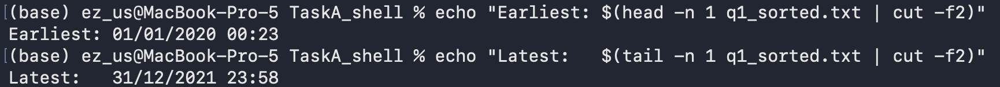
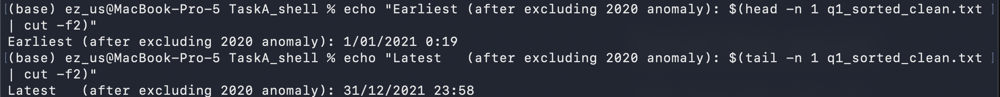

### Answer
Raw range: 01/01/2020 00:23 - 31/12/2021 23:58.
Anomaly identified: the single record 01/01/2020 00:23 is the only 2020 entry in the dataset (1 row out of 127,699 valid dates = 0.0008%). The assignment specification states the dataset contains transactions from 2021. The round time (00:23 on 1 January) and singleton year strongly suggest a year-typo data-entry error.
Range after excluding the anomaly: 1 January 2021 at 00:19 - 31 December 2021 at 23:58.

### Explaination

- Isolate `sold_time` column.
  - `cut -d, -f4`, cut the 4th column accordding to assignment desctiption.
  - `tr -d 'r'`, removes 'return' character.
  - `grep ...` filter rows with valid time format. 
  - output it as a new text file: q1_sold_times.txt, which include 127699 data.

- Sort sold_times.
  -  Standardise time format. current date would look like "M/D/YYYY H:S" or "MM/DD/YYYY HH:SS", Which determined by whether have "0" or not on date, and 24-hour time standard. It lead to disorder. Parse date form first, then sort.
    
  - `awk -F'[ /:]'` splits a string like `"27/03/2021 22:17"` on any of space, slash, or colon — so we get the five fields `27`, `03`, `2021`, `22`, `17`. 

  - Then `printf"%04d-%02d-%02d %02d:%02d\t%s\n", $3(year), $2(month), $1(day), $4(hour), $5(minuete), $0(Placeholder: No second here)` rearranges them year-first and prints both the sortable form and the original. 
    
  - `sort` orders the lines alphabetically — but because our key iszero-padded and year-first, alphabetical order IS chronological order.

- Strip off the first and last line to get answers
  - `echo` can be regarded as `print` or `cat`(R)

---


## Q2 - Preprocess the ID(f1) and sold_time(f4) column.

### Q2a - Count lines aren't 6-digit long.

#### Approach

regex `^[0-9]{6}$` would be valid ID

#### Code

 ```bash

# Step 0: disable strict UTF-8 (BSD cut fails otherwise)
export LC_ALL=C

 # Step 1: extract ID column, skip header
tail -n +2 TaskA_property_victoria.csv | cut -d, -f1 > q2a_ids.txt

 # Step 2: count rows whose ID isn't a 6-digit long nuber
 # grep -v inverts the match; -c means 'count'
 grep -vcE '^[0-9]{6}$' q2a_ids.txt

 grep -vE  '^[0-9]{6}$' q2a_ids.txt | sort | uniq -c

 ```

#### Screenshot
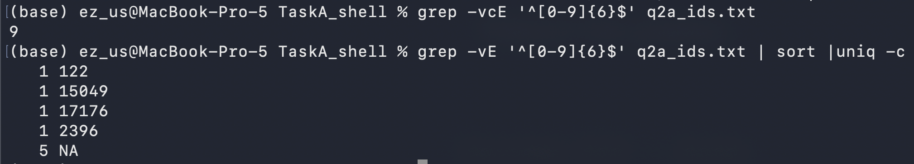

#### Answer

**9 rows** have an `ID` that is not a 6-digit number: 5 rows where the
ID is the literal string `NA`, and 4 rows whose IDs are short numbers
(`122`, `2396`, `15049`, `17176`).

#### Explanation

- `grep -v` keeps lines that **do not** match the pattern. `-c` return to the number of count.

- `^[0-9]{6}` means 6 digits. `$` limited the output **exactly** equal to 6.

-  `sort | uniq -c` arrange **unique count** value from small to large.


### Q2b — Drop bad-ID rows and strip the time from sold_time

#### Approach

Two transformations:
1. Keep the header plus rows valid ID, which matches `^[0-9]{6}$`.
2. In each kept row, remove the ` HH:MM` substring from column 4.

#### Code

``` bash

# Step 0: disable strict UTF-8 (BSD cut fails otherwise)
export LC_ALL=C 

# Step 1: extrack a valid ID. Keep header (NR==1) and rows with 6-digit long form.
awk -F, 'NR==1 || $1 ~ /^[0-9]{6}$/' TaskA_property_victoria.csv > q2b_valid_ids.csv

wc -l q2b_valid_ids.csv  # check

# output: 1 header + 127706 data rows = 127707

awk -F, 'BEGIN { OFS = "," } NR == 1 { print; next } { sub(/ [0-9]+:[0-9]+/, "", $4); print }' q2b_valid_ids.csv > filtered_property.csv

wc -l  filtered_property.csv   # check
# output: 1 header + 127706 data rows = 127707. No miss.

# Verify: 
# original 127716 - 9 bad rows = 127707 lines (header + 127706 data rows)
wc -l TaskA_property_victoria.csv filtered_property.csv
```

#### Screenshot

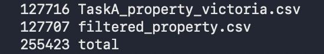

#### Explanation

- `awk -F, 'NR==1 || $1 ~ /^[0-9]{6}$/'` is the entire pattern. 
  - `NR==1` is true on the header row. 
  - `$1 ~ /^[0-9]{6}$/` is true on rows where the ID is exactly 6 digits. 
  - `||` means "or".

- `sub(/ [0-9]+:[0-9]+/, "", $4)` finds the first occurrence of " H:MM" or " HH:MM" inside column 4 and replaces it with empty. 
Because we assign to a field,  `awk` rebuilds the line `OFS = ","`: Since the input and output separators are both comma, every other field comes back byte-identical, including rows `description` contained unescaped commas.

- 127716 − 9 = 127707 — counts match Q2a.


### Q2c — Display first 5 lines of ID and sold_time

#### Code

```bash

export LC_ALL=C

cut -d, -f1,4 filtered_property.csv | head -n 6
```

#### Screenshot

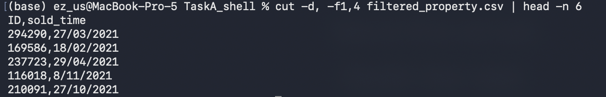

#### Explanation

- `cut -d, -f1,4` picks columns 1 and 4 (`ID` and `sold_time`); they're
  safe with `cut` because no commas appear inside the first four columns.

- `head -n 6` 1 header + the first 5 data rows


---


## Q3 — First and last mention of "Mount Dandenong" in `address`

### Approach

> Importand note for marker: This question uses filtered_property.csv, the cleaned dataset produced in Q2b (bad-ID rows dropped, time stripped from sold_time). The filtering performed in Q2b is the prerequisite for all subsequent questions in Task A.

Use `awk` to keep just the rows whose column 7(`address`) contains the literal `Mount Dandenong`. Then sort date.

### Code 

```bash

# Step 0: Switch the whole session to byte-mode (fixes the Illegal byte sequence)
export LC_ALL=C

# Step 1: keep only rows whose address (col 7) contains "Mount Dandenong"
awk -F, '$7 ~ /Mount Dandenong/' filtered_property.csv > q3_matches.csv

wc -l q3_matches.csv                # how many transactions matched - Ans: 44

# Step 2: extract sold_time (col 4), drop any stray CRs
cut -d, -f4 q3_matches.csv | tr -d '\r' > q3_dates.txt

head -n 3 q3_dates.txt   # sanity check: these should be DD/MM/YYYY

# Step 3: convert "D/M/YYYY" to "YYYY-MM-DD<TAB>original", sort
awk -F/ '{ printf "%04d-%02d-%02d\t%s\n", $3, $2, $1, $0 }' q3_dates.txt | sort  > q3_sorted.txt

head -n 2 q3_sorted.txt

# Step 4: read off first and last
echo "First mention: $(head -n 1 q3_sorted.txt | cut -f2)"
echo "Last  mention: $(tail -n 1 q3_sorted.txt | cut -f2)"

```

### Screenshot
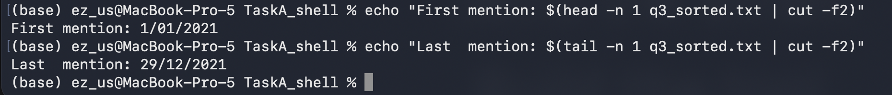


### Answer

- **First** (earliest) mention of "Mount Dandenong" in `address`: **1 January 2021**
- **Last** (latest) mention: **29 December 2021**

### Explanation

- `awk -F, '$7 ~ /Mount Dandenong/'`  column 7 contains the `Mount Dandenong` . Awk regexes are case-sensitive, so this matches the spec's requirement.
- `cut -d, -f4` extracts the `sold_time` column (now a date with no time, after Q2b). `tr -d '\r'` removes any `return`.
- Sort year-month-day.
- `echo` earliest an last line.


---


## Q4 — First/last sold_time: odd month, Townhouse, area > 300

> Importand note for marker: This question uses filtered_property.csv, the cleaned dataset produced in Q2b (bad-ID rows dropped, time stripped from sold_time). The filtering performed in Q2b is the prerequisite for all subsequent questions in Task A.

### Approach
Filter `odd month, Townhouse, area > 300`, remove `NA`. Then Sort and Print.


### Code

```bash

# Step 0: Switch the whole session to byte-mode (fixes the Illegal byte sequence)
export LC_ALL=C

# Step 1: keep only Townhouse rows
awk -F, '$12 == "Townhouse"' filtered_property.csv > q4_step1_townhouse.csv
wc -l q4_step1_townhouse.csv  # 10471

# Step 2: among Townhouses, keep rows where area is a plain number AND > 300.
# Patent1 of $11 matches a non-negative decimal (no NA, no "Xha", no "qq"); 
# Pattern 2: numeric value of $11 (forced by + 0) is greater than 300
awk -F, '$11 ~ /^[0-9]+(\.[0-9]+)?$/ && ($11 + 0) > 300' q4_step1_townhouse.csv > q4_step2_area.csv
wc -l q4_step2_area.csv  # 814 

# Step 3: keep only rows whose sold_time month is odd (1, 3, 5, 7, 9, 11)
# split($4, d, "/") gives d[1]=DD, d[2]=MM, d[3]=YYYY
# (d[2] + 0) % 2 == 1 is true only for odd months
awk -F, '{split($4, d, "/"); if((d[2] + 0) % 2 == 1) print}' q4_step2_area.csv >q4_step3_oddmonth.csv
wc -l q4_step3_oddmonth.csv   # 398

# Step 4: extract sold_time, build sortable key, sort
cut -d, -f4 q4_step3_oddmonth.csv | tr -d '\r'  | awk -F/ '{ printf "%04d-%02d-%02d\t%s\n", $3, $2, $1, $0 }' | sort  > q4_sorted.txt

# Step 5: report first and last
echo "First sold_time: $(head -n 1 q4_sorted.txt | cut -f2)"
echo "Last  sold_time: $(tail -n 1 q4_sorted.txt | cut -f2)"

```

### Screenshot
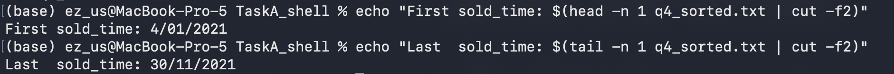

### Answer
- **First** matching `sold_time`: **4 January 2021**
- **Last** matching `sold_time`: **30 November 2021**

### Explanation
- Filter (1) Townhouse (2) area > 300 (3) odd month. 

- Process `NA`, and other wrong valua filter by regex `^[0-9]+(\.[0-9]+)?$`.
`$11 + 0` forces numeric context so the comparison is numerical (so `"800" > 300` is true and `"50" > 300` is false; without `+ 0`, awk would compare as strings and get `"50" > "300"` as true, which is wrong).

- `split($4, d, "/")` splits `"4/01/2021"` into `d[1]=4`, `d[2]=01`, `d[3]=2021`. `(d[2] + 0) % 2 == 1` find odd month. `+ 0` force ensure data format is number. i.e. `"01"` to be treated as the number 1, not as a string.


---


## Q5 — How many unique property types?

> Importand note for marker: This question uses filtered_property.csv, the cleaned dataset produced in Q2b (bad-ID rows dropped, time stripped from sold_time). The filtering performed in Q2b is the prerequisite for all subsequent questions in Task A.

### Approach

The answer is the number of distinct values in `property_type`, but inspection shows the column is **highly contaminated** with `area` numbers, an address fragment, and an `NA`. So report the raw count first *and* a cleaned count, with the wrangling spelled out.

### Code

```bash

# Step 0: Switch the whole session to byte-mode (fixes the Illegal byte sequence)
export LC_ALL=C

# Step 1: extract property_type column (col 12), skip header
tail -n +2 filtered_property.csv | cut -d, -f12 > q5_types.txt
wc -l q5_types.txt   # 127706

# Step 2: raw distinct count
sort -u q5_types.txt | wc -l  # 390

# Step 3: see the counts of various type — common types first, then the tail
sort q5_types.txt | uniq -c | sort -rn > q5_unique_v1.txt
head -n 15 q5_unique_v1.txt  # top 15 most common
tail -n 15 q5_unique_v1.txt  # bottom 15. You can see them is meanless. So filter out them next. Data wranling needed!

# Step 4: filter out garbage data(tail-like rows). Each grep -vE drops one category:
#   - "^NA$" 
#   - "^[0-9]+(\.[0-9]+)?(ha)?$"  — pure numbers and 'Xha'
#   - "^[0-9]+ .* VIC "  — address-like (e.g. "20 ... VIC 3984")
sort -u q5_types.txt  | grep -vE '^NA$' | grep -vE '^[0-9]+(\.[0-9]+)?(ha)?$' | grep -vE '^[0-9]+ .* VIC '  > q5_unique_v2.txt

wc -l q5_unique_v2.txt  # 34
cat q5_unique_v2.txt 

# Step 5: case-collapsed count ("Vacant Land" and "Vacant land" merge)
tr 'A-Z' 'a-z' < q5_unique_v2.txt | sort -u | wc -l

```

### Screenshot
- Step 2 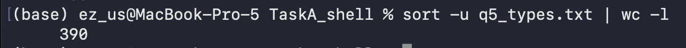
- Gabage Data format
  - Address
  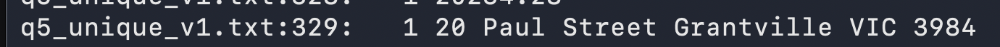
  - Number and NA type
  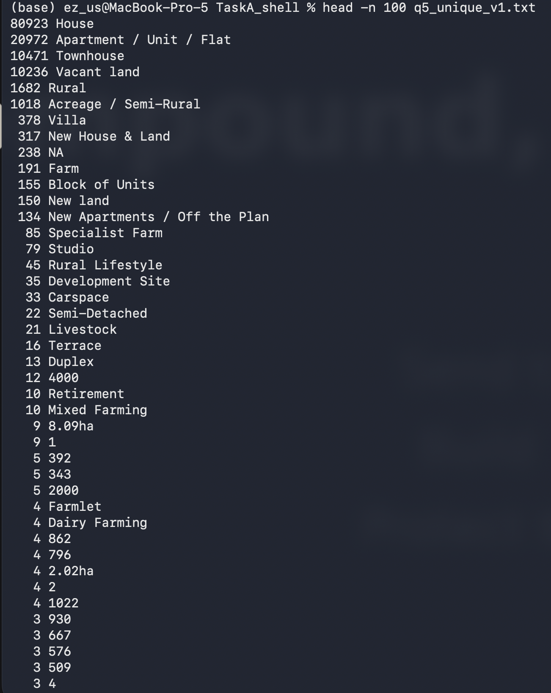 
- Step 3 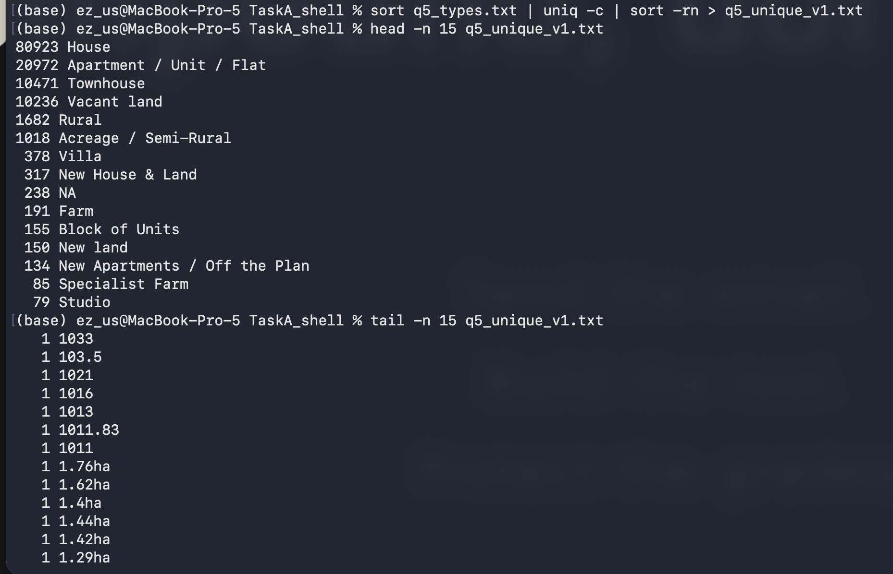
- Check result if they are purely unique or exist 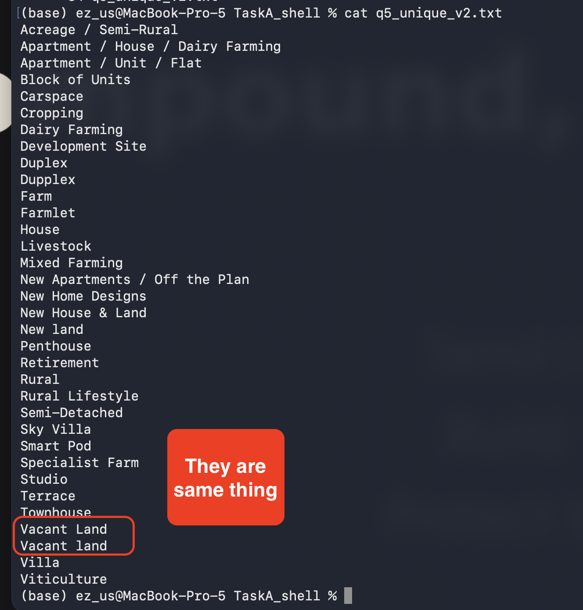
- 


### Answer
- **Raw distinct count**: 390 distinct strings in `property_type`. = Step 2
- **unique_v1 property types after removing garbage data(step 3)**: **34**.
- **After standarding case variants** (`Vacant Land` ↔ `Vacant land`): 
  **33**.

I report **34** (or **33**) as the meaningful answer, because the other 356 raw values are not property types — 354 are `area` numbers misplaced into the column, 1 is `NA`, and 1 is an address string.


### Explanation

- `-u` find the unique value, Extract to single test file. `wc -l` counts lines of the new file.
- `sort | uniq -c | sort -rn` chain — sort alphabetically so duplicates are adjacent, 
`uniq -c` counts each group, 
`sort -rn` re-sorts by count (numeric, big to small) so the most common types come first. Check the head for valid property names and the tail for meanless data(garbage).
- Filtering: Using `grep -vE` to remove the three patterns target the three garbage shapes spotted in step 3.
- Collapse: `tr 'A-Z' 'a-z'` converts(transfer) uppercase to lowercase; then `sort -u | wc -l` recounts distinct values. `Vacant Land` (1 row) and `Vacant land` (10,236 rows) merge, dropping the count from 34 to 33.


---


## Q6 — Description column investigations

> Importand note for marker: This question uses filtered_property.csv, the cleaned dataset produced in Q2b (bad-ID rows dropped, time stripped from sold_time). The filtering performed in Q2b is the prerequisite for all subsequent questions in Task A.

### Ground setup: extract description text for searching

So extract the 14th - `description` - column first

```bash

# Step 0: Switch the whole session to byte-mode (fixes the Illegal byte sequence)
export LC_ALL=C

# Build a description-only file used by Q6a and Q6b, and transfer clean to lowercase format(It mentioned ignore cases in question)
tail -n +2 filtered_property.csv | cut -d, -f14 | tr 'A-Z' 'a-z' > q6_descriptions.txt

wc -l q6_descriptions.txt  # 127706

```

### Q6a — Premium/luxury properties with outdoor entertaining areas

#### Code

```bash

# Step 1: keep descriptions premium OR luxury
grep -E '(premium|luxury)' q6_descriptions.txt > q6a_prem_lux.txt
wc -l q6a_prem_lux.txt

# Step 2: among those, keep ones mentioning "outdoor entertaining area" 
grep 'outdoor entertaining area' q6a_prem_lux.txt > q6a_prem_lux_out.txt
wc -l q6a_prem_lux_out.txt 

```

#### Screenshot
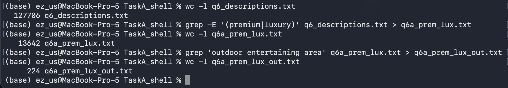


#### Answer
**224 transaction records** describe premium-or-luxury properties with
an outdoor entertaining area.

#### Explanation
- Built `q6_descriptions.txt` once and reuse it in both Q6a and Q6b.
  `tr [A-Z] [a-z]` lowercase to ignore cases,
- **Step 1**: `grep -E '(premium|luxury)'` keeps lines containing
  either keyword. `-E` enables extended regex so the `|` means "or"
- **Step 2**: filter 'outdoor entertaining area'.


### Q6b — Records mentioning a property size in their description

#### Approach
The spec gives two example forms: `Nm2` and `N sq metres`. I treat
those as my **reference unit list**. To extend the list, I:
1. consulted standard Australian property-area units (square metre, hectare, acre) from Google,
2. inspected the description column to confirm these forms are present in the data, and to spot any forms I missed.

#### Code

```bash

# Detect "digit + unit", "1249m2" likewise string
grep -oE '[0-9]+[a-z]+[0-9]*' q6_descriptions.txt | sort | uniq -c | sort -rn | grep -iE '(m2|sqm|acres?|hectare|ha)' | head -30

# Detect "digit + space + unit word", "758 sq metres" likewise string
grep -oE '[0-9]+ [a-z]+( [a-z]+)?' q6_descriptions.txt | sort | uniq -c | sort -rn | grep -iE '(sq|acres?|hectares?|metres?)' | head -30

# Now I know the forms used: m2, sqm, sq metres, square metres, acres, hectares, ha.
# Build the regex from observation:
grep -cE '[0-9]+m2|[0-9]+ ?sqm|[0-9]+ sq metres?|[0-9]+ square metres?|[0-9]+ acres?|[0-9]+ hectares?|[0-9]+ ?ha([ .,;]|$)' q6_descriptions.txt

```

#### Screenshot
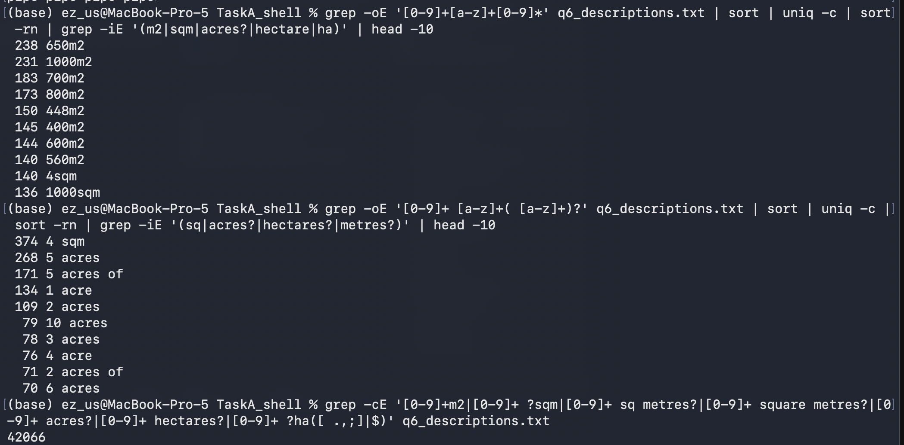

#### Answer
**42066 transaction records** mention property size information in
their description.

---

## Cleanup 

> if marker run code in this work, you can run the below code to remove intermiate files

To remove all intermediate files but keep `filtered_property.csv`, which generate in q2b(Drop bad-ID rows and strip the time from sold_time):

```bash

rm q*.txt q*_step*.csv q2b_valid_ids.csv q3_matches.csv # here can replace with the file(s) of qustion you mark

# Snitary check 
ls *.csv

```